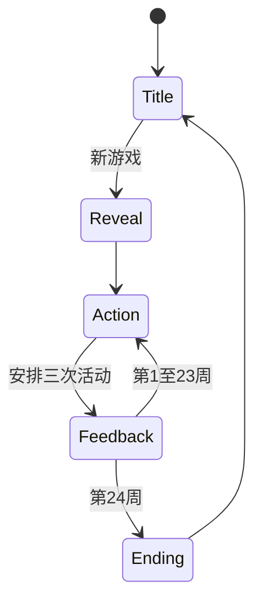

# Rising Star Maker vNext 计划

> 当前可玩版本及其规则快照见 [plan.mvp.md](plan.mvp.md)。
>
> 本计划只描述下一阶段尚未完成的设计与实施工作。

## 实施状态

- [x] 里程碑 A：运行时已改为 `ACTION → FEEDBACK`，月报和最终评价嵌入反馈页。
- [x] 里程碑 B：20 张情况卡、三级活动提示、8 周冷却、稀有上限和确定性抽取已实现。
- [~] 里程碑 C：12 维证据、每周证据上限、风险时间窗和现有 11 个结局的证据评分已实现；方向差距文案仍需细化。
- [ ] 里程碑 D：待从 11 个结局扩展到 30 个，并补充字符画和图鉴提示。
- [~] 里程碑 E：15 项规则测试和生产构建通过；30 结局完成后再运行 10,000 局分布模拟。

## 1. 目标

vNext 要让玩家在约 5 分钟内完成一局，同时做到：

1. 每周都有一个可理解的新情况，玩家用活动安排回应，而不是额外处理弹窗。
2. 月度评价和最终结局都能指出真实证据，使玩家理解“为什么是这个方向”。
3. 将结局从 11 个扩展到 30 个，并让不同结局依赖不同的行为签名，而不是只比较最高属性。
4. 结局页给出两个接近方向和可执行的下局提示，鼓励玩家验证另一种培养策略。
5. 随机事件制造意外，但相同种子与相同行动仍然完全可复现。

### 成功信号

- 5 名试玩者中至少 4 名能解释自己为何获得当前结局。
- 至少 3 名试玩者能根据结局提示，主动制定下一局不同的活动策略。
- 新玩家只用鼠标可在 4–7 分钟内完成一局。
- 10,000 局模拟中，30 个结局均有可达路线，没有单一正向结局占比超过 20%。

## 2. 范围

### 本阶段包含

- 固定为 `ACTION → FEEDBACK` 的两页面周循环。
- 每周固定抽取一张情况卡，与活动安排同时展示。
- 机会、风险、相关三级自然语言提示，不显示概率数字。
- 12 维隐藏证据账本。
- 可解释的月度评价与最终评价。
- 30 个结局及图鉴剪影提示。
- 结局近邻、差距提示和下局建议。
- 事件、证据、结局的确定性模拟与分布测试。
- 存档 schema 迁移。

### 本阶段不包含

- 事件卡上的独立 A/B 选择。
- 新增活动、体力、金钱、装备或技能树。
- 账号、后端、云存档、排行榜和多人玩法。
- 向玩家显示属性值、证据值、成功率或结局分数。
- 为 30 个结局分别制作完全独立的玩法系统。

## 3. 核心循环



### 3.1 ACTION 页面

每周只做一件事：看清本周情况后安排三次活动。

页面同时展示：

- 本周情况卡：标题、两句背景和稀有度外观。
- 受影响活动：只标记“机会”“风险”或“相关”。
- 实习生信息、Trait 和最近观察。
- 12 个活动及 3 个行程槽，允许重复活动。
- “开始本周”按钮。

玩家不需要点击情况卡，也不需要回答额外问题。忽略情况卡是合法策略。

### 3.2 FEEDBACK 页面

一次展示本周全部内容：

- 三项活动的大失败、失败、成功或大成功。
- 情况卡对相关行动产生的影响与一句自然语言归因。
- 本周新获得的 Trait。
- 新增或减弱的评价趋势，不显示数字。
- 第 4、8、12、16、20 周在同页下方追加月度评价。
- 第 24 周在同页下方直接追加最终评价。
- 页面底部只有一个主按钮：进入下一周或返回标题页。

月报和结局不再是独立的中间页面，避免破坏两页面循环。

## 4. 每周情况卡

### 4.1 玩家可见提示

只使用三级提示：

| 提示 | 含义 | 底层建议效果 |
| --- | --- | --- |
| 机会 | 本周更容易留下正面证据 | 失败率小幅下降，大成功率小幅上升 |
| 风险 | 本周更容易出错或返工 | 失败率上升，大失败率小幅上升 |
| 相关 | 不明显改变成功率，但可能留下特殊证据 | 成功后增加事件专属证据或命运标签 |

界面禁止出现 `+10%`、`-5` 或“结局权重”等信息。

### 4.2 牌组与频率

每周固定一张情况卡：

- 普通情况：45%。
- 机会事件：25%。
- 麻烦事件：20%。
- 稀有事件：10%。

约束：

- 同一事件 8 周内不重复。
- 前 4 周不出现高风险稀有事件。
- 每局最多 3 张稀有事件。
- 第 20 周以后提高职业相关机会的权重。
- Trait 可以改变候选事件权重，但不能保证某张牌出现。
- 相同种子、周数和历史状态必须抽到同一张牌。

### 4.3 第一批 20 张牌

| 类型 | ID | 标题 | 机会活动 | 风险活动 | 相关活动 | 命运标签 |
| --- | --- | --- | --- | --- | --- | --- |
| 普通 | `release_cleanup` | 发布前整理 | 编写测试、修复 Bug | 自由项目 | Kubernetes | `reliability` |
| 普通 | `docs_refresh` | 文档集中更新 | 阅读文档 | 生产事故 | 技术分享 | `documentation` |
| 普通 | `new_teammate` | 新成员加入 | 结伴编程、团队午餐 | 无 | Mentor 1:1 | `mentoring` |
| 普通 | `tech_debt_week` | 技术债清理周 | 修复 Bug、编写测试 | 开发功能 | 阅读文档 | `engineering` |
| 普通 | `quiet_week` | 没有紧急事项 | 阅读文档、自由项目 | 无 | Mentor 1:1 | `self_direction` |
| 机会 | `customer_visit` | 客户临时来访 | 演示成果 | 自由项目 | 开发功能、团队午餐 | `customer_facing` |
| 机会 | `internal_tech_fair` | 内部技术展 | 技术分享、演示成果 | 无 | 自由项目 | `public_speaking` |
| 机会 | `open_source_issue` | 开源项目收到 Issue | 自由项目 | 无 | 阅读文档 | `community` |
| 机会 | `cross_team_invite` | 跨团队调查邀请 | 结伴编程、阅读文档 | 无 | Mentor 1:1 | `cross_team` |
| 机会 | `research_seminar` | 研究分享会 | 技术分享、阅读文档 | 无 | 编写测试 | `research` |
| 麻烦 | `test_env_unstable` | 测试环境不稳定 | Kubernetes、编写测试 | 开发功能 | 修复 Bug | `troubleshooting` |
| 麻烦 | `requirement_shift` | 需求临时改变 | Mentor 1:1、结伴编程 | 开发功能、演示成果 | 阅读文档 | `adaptability` |
| 麻烦 | `mentor_busy` | Mentor 本周很忙 | 阅读文档、修复 Bug | Mentor 1:1 | 自由项目 | `independence` |
| 麻烦 | `incident_wave` | 线上事故频发 | 生产事故、修复 Bug | 自由项目 | 编写测试 | `incident_response` |
| 麻烦 | `team_disagreement` | 团队出现分歧 | Mentor 1:1、团队午餐 | 结伴编程 | 技术分享 | `conflict_handling` |
| 稀有 | `project_spotlight` | 自由项目突然被关注 | 自由项目、演示成果 | 无 | 技术分享 | `community_breakthrough` |
| 稀有 | `flight_club_day` | 飞行俱乐部开放体验 | 团队午餐、自由项目 | 无 | 阅读文档 | `aviation` |
| 稀有 | `customer_escalation` | 重要客户升级投诉 | 演示成果、修复 Bug、生产事故 | 无 | 团队午餐 | `customer_crisis` |
| 稀有 | `research_collaboration` | 收到研究合作邀请 | 阅读文档、技术分享 | 无 | 编写测试 | `research_opportunity` |
| 稀有 | `team_reorg` | 团队组织调整 | Mentor 1:1、团队午餐 | 无 | 技术分享 | `career_reflection` |

### 4.4 数据结构

```text
WeeklySituation
  id
  titleKey
  descriptionKey
  rarity
  minimumWeek
  maximumPerGame
  cooldownWeeks
  weight
  opportunityActivityIds
  riskActivityIds
  relatedActivityIds
  evidenceTags
```

`GameState` 新增：

```text
currentSituationId
situationHistory
rareSituationCount
```

## 5. 证据账本

属性决定“这次做成的可能性”，证据解释“这个人长期表现出了什么”。二者必须分离。

### 5.1 十二个证据维度

| ID | 中文含义 | 主要来源 |
| --- | --- | --- |
| `engineering` | 工程实现 | 修 Bug、开发功能、技术排查 |
| `reliability` | 可靠性 | 测试、回滚准备、稳定交付 |
| `research` | 研究能力 | 阅读、实验、研究事件、从失败继续调查 |
| `productSense` | 产品判断 | 需求澄清、用户问题、功能取舍 |
| `customerFacing` | 客户沟通 | 客户事件、演示、方案解释 |
| `communication` | 表达与协作 | 分享、结伴编程、会议和反馈处理 |
| `community` | 社区贡献 | 文档、教程、开源互动、公开分享 |
| `ownership` | 主动负责 | 独立推进、及时求助、闭环处理 |
| `resilience` | 失败恢复 | 失败后同类行动成功、复盘与重试 |
| `incidentResponse` | 事故响应 | 生产事故、排障、风险控制 |
| `leadership` | 影响他人 | 协调分歧、帮助同伴、跨团队推进 |
| `aviation` | 航空兴趣 | 航空事件和相关自由项目 |

证据范围为 0–100，但不向玩家显示。

### 5.2 基础记账

- 成功：活动主要证据 `+1`。
- 大成功：活动主要证据 `+2`，次要证据 `+1`。
- 失败：通常不扣证据；增加对应风险记录。
- 大失败：增加风险记录；只有涉及诚信、安全或越权时才扣可靠性或责任感。
- 失败后 4 周内，同一活动成功：`resilience +1`。
- 情况卡“相关”活动成功：对应事件证据 `+1`。
- 情况卡“机会”活动大成功：对应事件证据额外 `+1`。
- 同一证据单周最多增加 4，避免三次重复活动过度放大。

### 5.3 风险与趋势

证据账本同时维护最近 4 周的滚动记录：

```text
EvidenceLedger
  totals: Record<EvidenceId, number>
  weeklyDeltas: EvidenceDelta[24]
  risks:
    rework
    lateHelp
    unsafeAction
    unclearCommunication
    scopeCreep
```

月报比较最近 4 周与此前 4 周：

- 增长明显：使用“正在形成稳定记录”。
- 有记录但波动：使用“有过几次表现，还需要继续观察”。
- 最近下降：使用“本月出现反复”。
- 没有证据：不展示该维度。

## 6. 可理解的评价

### 6.1 月度评价

第 4、8、12、16、20 周的反馈页下方追加：

1. **本月确认**：最多 2 条，引用实际成功或大成功。
2. **仍需关注**：最多 2 条，引用真实失败模式，不评价人格。
3. **趋势变化**：最多 2 条，说明证据正在增加、波动或恢复。
4. **可能方向**：只在第 20 周首次出现。显示 3 个结局，分别给出一条已有证据和一条尚待观察的内容。前四份月报只谈过程，不提前给实习生贴职业标签。

示例：

```text
测试开发工程师
已有记录：最近多次主动补充边界测试。
尚待观察：任务时间紧张时能否维持同样的检查习惯。
```

禁止显示精确阈值、分数和百分比。

### 6.2 最终评价

最终反馈必须回答：

- 为什么得到当前结局：列出 3–5 条本局真实证据。
- 最接近的另外两个结局是什么。
- 当前结局胜过近邻结局的关键证据是什么。
- 下局可以尝试哪 1–2 种具体活动或事件机会。

示例：

```text
本局最接近：技术销售、产品经理

如果下次想尝试技术销售：
在客户相关情况出现时安排演示成果，并保留一定技术活动。
```

## 7. 三十个结局

### 7.1 判定框架

每个结局由四部分决定：

1. **资格门槛**：Trait、最低证据、失败负担或特殊事件标签。
2. **核心证据**：决定该结局与相似结局的主要区别。
3. **行为签名**：活动组合、结果趋势和风险模式。
4. **排名分数**：只在已具备资格的结局之间比较。

基础公式：

$$
S_e = \sum_i w_i stat_i + \sum_j v_j evidence_j + \sum_a u_a activityCount_a + \sum_t bonus_t - \sum_r penalty_r + seededTieBreak
$$

`seededTieBreak` 只允许在前两名基础分差不超过 3% 时生效，范围为 0–5。它制造近邻路线的小意外，不能推翻明显证据。

“未获转正”和“延长实习”先于职业结局判定：

- 未获转正：后期失败负担持续过高，可靠性和责任感没有改善。
- 延长实习：已出现明确成长，但稳定性或独立性证据仍不足。
- 早期失败但后期恢复，不得仅凭累计失败触发坏结局。

### 7.2 结局目录与行为签名

| 编号 | ID | 结局 | 核心证据 | 关键行为签名 |
| --- | --- | --- | --- | --- |
| 1 | `no_return_offer` | 未获转正 | 可靠性、责任感不足 | 后 8 周仍反复出现返工、晚求助或危险操作 |
| 2 | `internship_extended` | 延长实习 | 恢复力上升 | 后期改善明显，但独立交付尚不稳定 |
| 3 | `software` | 软件工程师 | 工程实现、责任感 | 功能、修 Bug、测试较均衡，稳定完成日常任务 |
| 4 | `frontend` | 前端工程师 | 产品判断、工程实现 | 功能与演示较多，能处理用户可见问题 |
| 5 | `backend` | 后端工程师 | 工程实现、可靠性 | 修 Bug、功能、事故与接口调查较多 |
| 6 | `mobile` | 移动端工程师 | 工程实现、产品判断 | 需要命中移动端机会事件，并有稳定功能交付 |
| 7 | `test_engineer` | 测试开发工程师 | 可靠性、工程实现 | 测试专精，能从边界和回归中发现问题 |
| 8 | `security` | 安全工程师 | 可靠性、事故响应 | 需要安全相关事件标签，危险操作少，调查证据强 |
| 9 | `performance` | 性能工程师 | 研究能力、工程实现 | 需要性能调查事件，擅长实验、测量和排查 |
| 10 | `site_reliability` | 站点可靠性工程师 | 事故响应、可靠性 | 事故、测试和回滚证据强，混沌受控 |
| 11 | `kubernetes` | Kubernetes 专家 | 事故响应、工程实现 | Kubernetes Trait，配置与排障成功记录 |
| 12 | `data_engineer` | 数据工程师 | 工程实现、可靠性 | 需要数据机会标签，重视管道、检查和可恢复性 |
| 13 | `ml_engineer` | 机器学习工程师 | 工程实现、研究能力 | 研究与交付并重，需要 ML 机会标签 |
| 14 | `data_scientist` | 数据科学家 | 研究能力、产品判断 | 数据分析事件、实验与业务问题结合 |
| 15 | `applied_scientist` | 应用科学家 | 研究能力、责任感 | 研究证据高且能把实验结果交付给团队 |
| 16 | `research` | 研究员 | 研究能力、恢复力 | 容忍实验失败，持续阅读、提问和验证 |
| 17 | `product` | 产品经理 | 产品判断、沟通 | 需求澄清、1:1、演示与功能取舍 |
| 18 | `program_manager` | 技术项目经理 | 沟通、责任感 | 跨团队、计划调整、风险跟进和闭环 |
| 19 | `solutions_architect` | 解决方案架构师 | 客户沟通、工程实现 | 客户问题与技术方案并重，跨系统证据强 |
| 20 | `technical_sales` | 技术销售 | 客户沟通、表达 | 客户事件中的演示和方案解释成功 |
| 21 | `technical_community` | 技术社区工程师 | 社区贡献、表达 | 教程、公开分享、社区答疑和纠错 |
| 22 | `support_engineer` | 客户支持工程师 | 客户沟通、事故响应 | 客户升级、复现、排障和清楚解释 |
| 23 | `ux_researcher` | 用户研究员 | 产品判断、研究能力 | 用户问题、访谈类事件和证据整理 |
| 24 | `technical_writer` | 技术作家 | 社区贡献、可靠性 | 文档专精，内容持续准确并被他人采用 |
| 25 | `programming_instructor` | 编程讲师 | 表达、影响他人 | 分享、结伴、帮助新人和教学事件 |
| 26 | `open_source` | 开源维护者 | 社区贡献、责任感 | 开源 Trait，持续处理 Issue、PR 和发布 |
| 27 | `founder` | 创业者 | 产品判断、责任感 | 自由项目、用户反馈、野心和可控混沌 |
| 28 | `independent_developer` | 独立开发者 | 工程实现、创造力 | 自由项目专精，独立闭环，不依赖高社交 |
| 29 | `staff` | Staff 工程师 | 影响他人、责任感 | 架构 Trait、跨团队、系统视角和帮助他人 |
| 30 | `flight` | 飞行员 | 航空兴趣 | 航空机会与长期兴趣证据，覆盖普通职业路线 |

### 7.3 当前 11 个结局迁移签名

现有结局先迁移到证据系统，避免等待 30 个全部完成后才验证：

| 现有结局 | 资格 | 核心证据 | 主要加分 | 主要减分 |
| --- | --- | --- | --- | --- |
| 未获转正 | 后期失败模式持续 | 可靠性、责任感不足 | 无 | 后期恢复明显 |
| 软件工程师 | 无硬 Trait | 工程实现、可靠性 | 功能、修 Bug、测试均衡 | 危险操作、长期单一刷活动 |
| 产品经理 | 无硬 Trait | 产品判断、沟通 | 功能、1:1、演示、需求变化处理 | 只做技术活动且无用户证据 |
| 研究员 | 无硬 Trait | 研究能力、恢复力 | 阅读、分享、实验失败后继续调查 | 结论无依据、长期不闭环 |
| 技术销售 | 无硬 Trait | 客户沟通、表达 | 客户事件、演示、技术理解 | 只有社交但缺少技术证据 |
| 技术社区工程师 | 社区或公开表达证据 | 社区贡献、表达 | 文档、分享、演示、开源互动 | 内容错误后不修正 |
| Staff 工程师 | 架构脑 | 影响他人、责任感 | 跨团队、系统视角、帮助同伴 | 只画架构不交付 |
| 开源维护者 | 开源上瘾 | 社区贡献、责任感 | Issue、PR、发布、回应批评 | 只开项目不维护 |
| 创业者 | 创业梦想家 | 产品判断、责任感 | 自由项目、用户反馈、可运行版本 | 失控扩张、没有用户证据 |
| 飞行员 | 航空宅 | 航空兴趣 | 飞行事件、模拟器项目 | 单次偶然事件不足以触发 |
| Kubernetes 专家 | Kubernetes 信徒 | 事故响应、工程实现 | 配置、排障、回退、生产事故 | 越权操作和无回退方案 |

## 8. 数值调整

### 8.1 属性成长

当前 72 次活动容易让多项属性封顶。vNext 调整为：

- 初始属性继续为 35–65。
- 普通活动基础成长从 `+2/+3` 调整为 `+1/+2`。
- 成功额外最多 `+1`。
- 大成功额外最多 `+2`。
- 失败主要增加风险记录，不普遍扣能力。
- 大失败只在对应能力或判断确实受影响时扣 `1–3`。
- 属性达到 75 后，正向成长乘以 0.5 并四舍五入。
- 属性达到 90 后，不再从普通成功中成长。

### 8.2 重复活动

重复代表专精，也带来视野狭窄风险：

- 同一周三次相同活动：相关专业证据正常增加，混沌 `+2`。
- 最近 4 周内某活动占比超过 50%：每周混沌 `+1`。
- 一周覆盖三个不同类别：混沌 `-1`。
- 重复活动不能直接降低成功率。
- 专精结局可以从重复活动获益，但通才结局会降低排名。

### 8.3 情况卡概率修正

初始建议值：

- 机会活动：失败概率 `-5` 个百分点，大成功概率 `+5` 个百分点。
- 风险活动：失败概率 `+8` 个百分点，大失败概率 `+3` 个百分点。
- 相关活动：不修改成功率。
- 所有修正后，大失败保底 2%，大成功上限 35%。

具体数值必须通过模拟调整，不写入玩家文案。

## 9. 图鉴与重玩提示

30 个结局在图鉴中都显示槽位：

- 已发现：名称、描述和发现次数。
- 未发现：剪影、稀有度和一句模糊提示。
- 不显示精确解锁条件。

提示例：

- “经常替别人讲清技术。”
- “一次客户危机可能改变方向。”
- “失败以后，仍然继续验证同一个问题。”
- “一个周五项目得到了陌生人的回应。”

结局页显示两个近邻方向及下局建议，建议必须来自实际差距，不使用固定广告语。

## 10. 数据与存档迁移

`GameState.schemaVersion` 升级，新增：

```text
currentSituationId
situationHistory
rareSituationCount
evidenceLedger
weeklyRiskHistory
```

迁移策略：

- HumanDex 保留现有 Trait 和 11 个结局发现记录。
- 旧进行中存档不推断历史证据，显示一次说明后开始新局。
- 新旧结局 ID 能复用的必须保持不变。
- `developer_relations` ID 迁移为展示名“技术社区工程师”，内部 ID 可在首轮实现时统一改为 `technical_community`，并提供 HumanDex 映射。

## 11. 实施顺序

### 里程碑 A：两页面循环

- 把月报并入反馈页。
- 把第 24 周最终评价并入反馈页。
- 删除运行时 `report` 独立页面状态。
- 保持一局约 5 分钟。

### 里程碑 B：情况卡

- 实现 20 张初始牌。
- 在 ACTION 页展示卡片和三级活动提示。
- 在 FEEDBACK 页展示事件影响归因。
- 实现冷却、稀有上限和确定性抽取。

### 里程碑 C：证据与解释

- 实现 12 维证据账本和 5 类风险记录。
- 将前四份月报改为确认、关注、趋势三块，第 20 周再增加可能方向。
- 最终评价增加近邻结局、关键差异和下局建议。
- 先迁移当前 11 个结局。

### 里程碑 D：30 个结局

- 分三批增加：工程类、研究数据类、产品客户与特殊类。
- 为新职业补足必要的情况卡和命运标签。
- 图鉴增加 30 个槽位和未发现提示。

### 里程碑 E：数值模拟与发布

- 编写无 DOM 的批量模拟器。
- 对随机、均衡、专精、极端和事件追逐策略各运行 10,000 局。
- 调整事件频率、证据阈值、失败结局和结局分布。
- 完成浏览器冒烟测试和 GitHub Pages 验证。

## 12. 验收标准

### 核心循环

- 除标题和初次揭晓外，一局只在 ACTION 与 FEEDBACK 两种页面间循环。
- 每周情况卡与活动安排同页出现，不增加独立确认步骤。
- 三项结果、情况影响、Trait、月报或结局在一次反馈中展示。

### 可解释性

- 每份月报引用本局真实事件，不生成不存在的评价。
- 第 20 周起，每个方向显示至少一条已有证据和一条尚待观察内容。
- 最终结局显示 3–5 条真实证据、两个近邻方向和一条可执行下局建议。
- 早期失败但后期恢复的角色不会仅因累计失败被判定未转正。

### 随机性

- 相同种子和相同行动产生相同情况卡、结果、证据和结局。
- 每局最多 3 张稀有情况卡，同一张卡 8 周内不重复。
- 随机卡可以改变近邻路线，不能无视明显证据强行改变结局。

### 分布

- 30 个结局均存在至少一条自动化可达路线。
- 10,000 局综合策略模拟中，没有单一正向结局超过 20%。
- 均衡策略的未获转正率目标为 2%–12%。
- 延长实习率目标为 3%–15%。
- 稀有与特殊结局合计目标为 15%–35%。

### 性能与体验

- 新玩家一局耗时 4–7 分钟。
- 1280 像素宽无横向滚动，768 像素宽可完整操作。
- 所有新增中文文案继续集中在 `zh-CN.json`。
- 所有字符画继续为纯英文 ASCII。

## 13. 测试矩阵

| 测试 | 断言 |
| --- | --- |
| 情况卡确定性 | 同 seed、周数、历史得到同一张卡 |
| 情况卡冷却 | 8 周内不重复 |
| 稀有上限 | 单局不超过 3 张 |
| 提示完整性 | 每个受影响活动都有机会、风险或相关提示 |
| 证据记账 | 活动、结果和情况组合产生预期证据 |
| 失败恢复 | 失败后成功增加恢复力 |
| 月报溯源 | 每条评价都能关联事件 ID |
| 近邻解释 | 第二、第三结局与最终结局分数可比较 |
| 结局可达 | 30 个结局各有固定路线 |
| 坏结局趋势 | 后期恢复能降低未转正风险 |
| 存档迁移 | 旧 HumanDex 发现记录不丢失 |
| 内容校验 | 缺失事件、证据、结局文案时构建失败 |

## 14. 风险与控制

| 风险 | 控制 |
| --- | --- |
| 30 个结局只有名字不同 | 每个结局必须有独立核心证据和行为签名 |
| 情况卡暗示唯一正确答案 | 保留忽略事件的合法路线，提示不显示数值 |
| 反馈页信息过长 | 事件归因只显示在受影响活动，月报限制条数 |
| 证据系统过于复杂 | 属性只管单次结果，证据只管长期评价，职责分离 |
| 随机事件抢走玩家决定权 | 事件只改变环境，活动安排仍是唯一周操作 |
| 坏结局突兀 | 使用后 8 周趋势与月报预警，不只看累计失败 |
| 职业名称过度机器翻译 | 玩家可见名称优先采用常见中文岗位称呼 |
| 五分钟目标被内容拖慢 | 不增加额外页面和事件选择，所有反馈同页收拢 |

## Next steps

1. 实现 `WeeklySituation` 数据结构、20 张牌和 ACTION 页三级提示，先保持现有结局规则不变。
2. 实现 `EvidenceLedger` 与反馈归因，再把当前 11 个结局迁移到证据签名。
3. 完成两页面循环后，按结局目录分批扩展到 30 个，并运行 10,000 局模拟调参。
