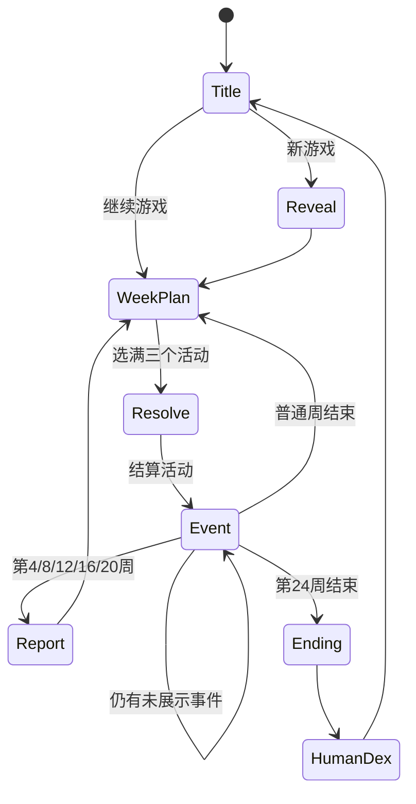

# Rising Star Maker MVP 计划

> 培养。观察。误解。
>
> “这只刚捕获的野生工程师，最后会进化成什么？”

## 1. 一句话介绍

《Rising Star Maker》是一款受经典养成游戏启发的中文单机网页游戏。玩家扮演 Mentor，在 24 周实习期内为一名随机生成的实习生安排工作、学习和社交活动。玩家看不到真实属性，只能从字符画、行为事件、月报和 Trait 推测其成长方向，并在毕业时发现这个人究竟“长成了什么”。

游戏使用原创角色、原创中文文案和原创规则，不复用其他游戏的名称、角色、图片、音乐或文本。

## 2. MVP 要验证的问题

MVP 只验证三件事：

1. 从有限行为推测隐藏成长方向是否有趣。
2. 安排活动后出现意外 Trait 和结局是否会让玩家想再玩一局。
3. 字符画、桌面窗口和鼠标按钮能否形成统一、鲜明且低成本的美术风格。

成功信号：5 名试玩者中至少 4 名能说出自己对实习生成长方向的判断，至少 3 名愿意主动开始第二局。

## 3. MVP 范围

### 必须包含

- 一局 24 周，每周选择 3 次活动，允许重复，一次性结算。
- 随机姓名、字符画头像、初始观察和隐藏属性。
- 12 个活动，每个活动包含大失败、失败、成功和大成功，共 48 个中文事件。
- 12 个可解锁 Trait、11 个结局。
- 第 4、8、12、16、20 周月报，第 24 周毕业评价。
- 当前局自动存档、继续游戏、重新开始。
- HumanDex 图鉴，跨局保存已发现的 Trait 和结局。
- 全程可以只用鼠标完成。
- 静态构建并部署到 GitHub Pages。
- 所有玩家可见的中文文案集中存放，与规则代码分离。

### 明确不做

- 账号、后端、云存档、排行榜、多人玩法。
- 多存档槽、导入导出、分享图片。
- 完整 Trait 进化树、装备、金钱、体力、失败 Game Over。
- 音乐、配音、复杂动画、拖放、画布热点。
- 国际化和移动端专项设计。首版只保证桌面和平板宽度可用。
- 真实公司、真实产品、真实人物和内部术语。

任何新想法默认进入“MVP 后”，不能在当前版本中增加活动或 Trait 数量；结局当前锁定为 11 个。

## 4. 核心体验原则

### 4.1 隐藏数值，可见行为

玩家永远看不到属性数字、事件权重和结局分数。活动说明只能提示倾向，例如“可能提升独立解决问题的机会”，不能承诺精确效果。

### 4.2 Trait 比属性更有记忆点

属性只负责驱动规则。玩家真正看到和记住的是 Trait，例如“文档地精”“咖啡驱动”“架构脑”和“航空宅”。

### 4.3 意外必须可以回溯

结局可以荒诞，但不能像纯随机。最终评价必须列出 3 至 5 条本局真实发生过的关键行为，让玩家理解它为何出现。

### 4.4 中文文案是内容源

游戏逻辑只引用稳定 ID。活动名、按钮、事件、月报、Trait、结局和提示语全部从中文内容文件读取。修改中文不应要求修改规则函数。

## 5. 一局流程

1. **标题页**：新游戏、继续游戏、HumanDex、清除数据。
2. **实习生揭晓**：显示姓名、字符画头像和一条模糊的初始观察。
3. **每周计划**：从 12 张活动卡中点击选择 3 次，允许重复选择同一活动；点击已选槽位可撤销该次选择。
4. **本周结算**：同页显示 3 个事件及其大失败、失败、成功或大成功结果；获得的 Trait 显示在对应事件下方；一次点击进入下一周或月报。
5. **月报**：每 4 周显示行为摘要、已有 Trait 和三个可能的发展方向。
6. **毕业评价**：第 24 周结算后显示关键经历、最终结局、稀有度和专属字符画。
7. **图鉴更新**：保存新发现的 Trait 和结局，可返回标题或开始新一局。



状态改变顺序固定为“计算结果、写入状态、保存、渲染”，避免刷新后重复结算。

## 6. 视觉和交互规格

### 6.1 美术方向

- 页面像一台旧式人才培养终端，深色背景、单色或少量强调色、硬边框和等宽字体。
- 角色、场景、Trait 和结局使用字符画，不使用像素图片替代字符画。
- 字符画保存在文案数据中，以字符串数组逐行保存，渲染时使用 `<pre>` 和等宽字体。
- 字符画只负责展示，不把字符位置做成点击区域。
- 动效仅允许 100 至 200 ms 的淡入、光标闪烁和按钮按下反馈，并支持 `prefers-reduced-motion`。

### 6.2 培养页布局

- 顶栏：姓名、`第 N / 24 周`、设置按钮。
- 左栏：角色字符画、已观察 Trait、最近一句行为。
- 主区：按“工作、学习、社交、危险”分组的 12 张活动卡。
- 底栏：3 个本周行程槽和“开始本周”按钮。
- 右栏：可滚动的观察日志，只显示最近 12 条。

### 6.3 鼠标规则

- 单击活动卡，将其放入第一个空槽。
- 单击已选活动卡或行程槽，将其移除。
- 选满 3 次活动后，“开始本周”才可点击。
- 危险活动有醒目标记，但不使用确认弹窗打断每周流程。
- 所有点击目标都使用真实 `<button>`，最小尺寸 44 × 44 CSS 像素，并保留键盘焦点样式。

## 7. 游戏规则

### 7.1 隐藏属性

固定使用 7 项，范围均为 0 至 100：

| ID | 中文含义 |
| --- | --- |
| `technical` | 技术理解 |
| `curiosity` | 好奇心 |
| `independence` | 独立性 |
| `social` | 社交能量 |
| `creativity` | 创造力 |
| `ambition` | 野心 |
| `chaos` | 混沌度 |

创建角色时，每项由带种子的随机数生成 35 至 65。若总和不在 330 至 370，按相同比例缩放至总和 350，再四舍五入；舍入差值按属性表顺序逐项补齐。活动和事件修改属性后，统一截断到 0 至 100。

### 7.2 活动表

表中数值只用于首版平衡，绝不直接显示给玩家。

| 类别 | ID | 中文名 | 每次基础变化 |
| --- | --- | --- | --- |
| 工作 | `fix_bug` | 修复 Bug | 技术 +3，独立 +1 |
| 工作 | `build_feature` | 开发功能 | 技术 +2，创造 +2 |
| 工作 | `write_tests` | 编写测试 | 技术 +2，独立 +1，混沌 -1 |
| 学习 | `read_docs` | 阅读文档 | 好奇 +3，技术 +1 |
| 学习 | `pair_programming` | 结对编程 | 技术 +2，社交 +1 |
| 学习 | `tech_talk` | 技术分享 | 好奇 +2，社交 +2 |
| 社交 | `team_lunch` | 团队午餐 | 社交 +3，混沌 +1 |
| 社交 | `mentor_1on1` | Mentor 1:1 | 独立 +2，野心 +2 |
| 社交 | `demo` | 演示成果 | 社交 +2，野心 +2 |
| 危险 | `production_incident` | 围观生产事故 | 技术 +3，独立 +2，混沌 +2 |
| 危险 | `touch_kubernetes` | 触碰 Kubernetes | 技术 +2，好奇 +2，混沌 +3 |
| 危险 | `friday_project` | 周五自由项目 | 创造 +3，野心 +1，混沌 +3 |

同一周和跨周都允许重复活动，并通过 `activityCounts` 记录累计次数。

### 7.3 事件选择

每个活动有大失败、失败、成功和大成功 4 个结果，共 48 条事件文本。结果由实习生与活动相关的隐藏属性和带种子的随机数共同决定，属性更高会提高成功机会，但不会排除失败。

每次活动按以下顺序结算：

1. 应用活动基础变化并增加活动计数。
2. 取活动正向影响的隐藏属性平均值作为当前能力，不把混沌度视为能力。
3. 使用带种子的随机数掷出结果，并由当前能力对结果作有限修正。
4. 选择对应结果事件，应用额外属性变化和可见计数器变化。
5. 检查 Trait，单次活动最多解锁 1 个；候选按 `priority` 从高到低选择。
6. 将结果和结果等级写入观察日志。

相同初始种子和相同的 72 个活动选择，必须产生完全相同的事件、Trait 和结局。

### 7.4 可见计数器

月报和毕业评价可以显示以下整数，但不显示隐藏属性：

- `bugsFixed`：修复 Bug 数。
- `docsRead`：阅读文档数。
- `questionsAsked`：主动提问数。
- `demosGiven`：演示次数。
- `socialEscapes`：逃离社交场合次数。
- `sideProjects`：启动自由项目数。
- `incidentsObserved`：围观事故数。
- `scopeCreep`：擅自扩大任务范围次数。

### 7.5 Trait 清单与条件

条件在每次活动结算后检查。属性条件中的数字对玩家隐藏。

| Trait | 解锁条件 | 结局倾向 |
| --- | --- | --- |
| 好奇宝宝 | 好奇 ≥ 65 | 研究、开源 |
| Bug 猎人 | `fix_bug` ≥ 5 且技术 ≥ 60 | 工程师、安全 |
| 文档地精 | `read_docs` ≥ 5 且好奇 ≥ 60 | Staff、开源 |
| 测试守门员 | `write_tests` ≥ 5 且技术 ≥ 60 | Staff、安全 |
| 咖啡驱动 | 第 8 周后，三种社交活动累计 ≥ 6 | 产品、创业 |
| 会议地精 | `tech_talk + team_lunch + demo` ≥ 10 且社交 ≥ 65 | 产品工程师 |
| 架构脑 | 技术 ≥ 75、好奇 ≥ 70 且拥有 Bug 猎人或文档地精 | Staff |
| 开源上瘾 | `friday_project` ≥ 5 且创造 ≥ 65 | 开源维护者 |
| 创业梦想家 | `friday_project` ≥ 6、野心 ≥ 65 且混沌 ≥ 55 | 创业者 |
| Kubernetes 信徒 | `touch_kubernetes` ≥ 5 且好奇 ≥ 65 | K8s 先知 |
| 航空宅 | 任一带 `aviation` 标签的事件出现 3 次 | 飞行教员 |
| 混沌善人 | 混沌 ≥ 75 且至少有 4 个不同 Trait | 传奇路线 |

“航空宅”所需的 3 个带标签事件必须分布在至少 2 种活动中，避免玩家只刷一个按钮。事件文本应先从“盯着机场代码看”逐渐升级到“给飞行模拟器写插件”，让路线可回溯。

### 7.6 月报

月报展示：

- 本月 2 至 4 条关键行为。
- 当前所有已观察 Trait。
- 3 项可见计数器。
- “目前可能的发展方向”前三名，只显示结局方向名称，不显示百分比和分数。

方向使用最终结局评分实时排序。若少于 3 个结局满足硬条件，则用评分最高的普通结局补足。

### 7.7 结局判定

每个结局按以下公式计算：

$$
S_e = \sum_i w_{e,i} \times stat_i + \sum_a u_{e,a} \times activityCount_a + \sum_t bonus_{e,t} + \sum_c v_{e,c} \times counter_c
$$

- 先计算失败负担：失败计 1，大失败计 2，再加需求失控计数；达到 36 时直接进入“未获转正”。
- 其余情况先排除不满足 `requirements` 的结局。
- 选择得分最高者。
- 同分时选择 `priority` 更高者，再同分则按结局 ID 排序。
- 结局判定不再使用随机数。

当前的 11 个结局：

| 稀有度 | 结局 | 硬条件或主要倾向 |
| --- | --- | --- |
| 普通 | 未获转正 | 失败负担达到 36，覆盖其他结局 |
| 普通 | 软件工程师 | 无硬条件，技术权重最高 |
| 普通 | 产品经理 | 创造、社交、功能开发和 1:1 |
| 普通 | 研究员 | 好奇、技术、文档阅读和技术分享 |
| 普通 | 技术销售 | 社交、野心、演示和团队午餐 |
| 稀有 | 技术社区工程师 | 技术分享、文档、演示和社区答疑 |
| 稀有 | Staff 工程师 | 架构脑，技术、独立 |
| 稀有 | 开源维护者 | 开源上瘾，创造、好奇 |
| 稀有 | 创业者 | 创业梦想家，野心、混沌 |
| 史诗 | 飞行员 | 航空宅，社交或独立 |
| 传奇 | Kubernetes 专家 | Kubernetes 信徒 + 混乱善良 |

具体权重统一保存在结局数据中。普通结局永远可达，特殊结局必须拥有对应 Trait 才可进入候选。

## 8. 中文内容设计

### 8.1 文件边界

建议内容目录：

| 文件 | 由谁修改 | 内容 |
| --- | --- | --- |
| `src/content/zh-CN.json` | 文案作者 | 所有中文界面、事件、报告和结局文本 |
| `src/content/ascii.json` | 文案或美术作者 | 角色、Trait、场景和结局字符画 |
| `src/data/activities.json` | 规则作者 | 活动 ID、数值和事件引用 |
| `src/data/events.json` | 规则与文案共同维护 | 事件条件、权重、效果和文案键 |
| `src/data/traits.json` | 规则作者 | Trait 条件和优先级 |
| `src/data/endings.json` | 规则作者 | 结局条件、权重和优先级 |

`zh-CN.json` 使用扁平键值，例：`event.fix_bug.stale_docs.a`。逻辑文件中禁止出现面向玩家的中文完整句子。

### 8.2 事件模板字段

```text
id                稳定 ID
activityId        所属活动
textKeys          两个中文文案键
weight            正整数，默认 1
requirements      可选的周数、属性、计数器或 Trait 条件
statDeltas        可选的隐藏属性变化
counterDeltas     可选的可见计数器变化
tags              例如 aviation、social_escape
highlight         是否可进入月报关键行为
```

### 8.3 中文文案语气

- 叙述者是负责带实习生的 Mentor，使用第一人称记录自己看见和处理的事情。
- 温和体现在不急着给人定性、不把一次失败等同于能力或品格，而不是让所有角色说话都柔软。
- 错误、返工、回滚、道歉和操作后果必须如实写出；笑点来自具体观察和反差，不来自羞辱或刻板印象。
- 避免堆叠“安静、慢慢、光、路、呼吸、远方”等抽象意象，优先写动作、判断和后果。
- 不直接写“技术 +3”“触发创业路线”等规则信息。
- 月报允许保留不确定判断，结局可以意外，但要引用本局实际行为。

### 8.4 首版内容预算

- 12 个活动名、说明和字符图标。
- 48 条四档结果事件文案。
- 12 个 Trait 名称、描述和小型字符画。
- 11 个结局名称、描述、2 条专属总结句和大型字符画。
- 24 个姓名、12 条初始观察。
- 5 份月报标题和 20 条可组合的摘要句。
- 20 条通用界面文案和错误提示。

先用占位文案跑通规则，再逐条替换。发布门槛是所有占位符均被内容校验发现并清零。

## 9. 技术方案

### 9.1 技术栈

- Vite + TypeScript。
- 原生 DOM 和 CSS，不引入 React、Vue、状态库或 UI 组件库。
- Vitest 测试规则、随机数、存档和内容引用。
- Playwright 只保留 1 条从新游戏到结局的浏览器冒烟测试。
- 无后端，无运行时网络请求，无第三方分析脚本。

### 9.2 模块职责

- `game/rng.ts`：带种子的伪随机数生成器。
- `game/reducer.ts`：纯函数状态转移，不读写 DOM 或 `localStorage`。
- `game/rules.ts`：事件筛选、Trait 检查、月报排序和结局评分。
- `game/storage.ts`：当前局、设置和 HumanDex 的保存、读取与迁移。
- `ui/render.ts`：根据 `phase` 渲染页面。
- `ui/actions.ts`：把点击转成 reducer action。
- `content/` 与 `data/`：中文文案、字符画和规则数据。

### 9.3 存档结构

当前局与 HumanDex 使用不同的 `localStorage` key，清除当前局不能误删图鉴。

```text
SaveGame
  schemaVersion
  seed
  phase
  week
  internProfile
  hiddenStats
  traitIds
  counters
  selectedActivityIds
  pendingResults
  eventHistory
  monthlyReports
  updatedAt

HumanDex
  schemaVersion
  discoveredTraitIds
  discoveredEndingIds
  gamesCompleted
```

读取失败时显示“存档无法恢复”，允许重置当前局，同时保留可正常解析的 HumanDex。

### 9.4 内容校验

构建前必须验证：

- ID 唯一，所有引用存在。
- 所有文案键和字符画键存在。
- 没有未引用的文案键，允许显式白名单。
- 属性名、条件操作符、权重和数值范围合法。
- 每个活动恰好有 4 个事件，且分别对应大失败、失败、成功和大成功。
- 每个特殊结局的必需 Trait 存在且理论上可解锁。
- 不存在 `TODO`、`TBD`、`PLACEHOLDER` 或空字符串。

## 10. GitHub Pages 部署

- 使用 GitHub Actions 在每次推送到默认分支时执行安装、内容校验、单元测试和构建。
- 仅在全部通过后，把 Vite 的 `dist` 作为 Pages artifact 发布。
- Vite `base` 从仓库名配置，确保项目站点子路径下的 JS 和 CSS 地址正确。
- 应用使用单页内状态切换，不依赖客户端路由，因此直接刷新不会产生 404。
- README 写明本地开发、测试、构建、部署和修改中文文案的方法。

## 11. 实施顺序

### 里程碑 A：可完成的一局

实现数据类型、随机数、状态机、12 个活动、临时事件、Trait、结局和自动存档。用纯文本界面跑通 24 周。

完成标准：固定种子和选择可以稳定得到同一结局；刷新不会重复结算。

### 里程碑 B：字符画鼠标界面

实现标题、揭晓、培养、结果、月报、结局和 HumanDex 页面，完成桌面终端视觉和鼠标操作。

完成标准：不打开开发者工具、不使用键盘，也能从新游戏玩到结局。

### 里程碑 C：中文内容与平衡

补齐 48 条四档事件、Trait、月报和 11 个结局文案；运行批量模拟并调整概率。

完成标准：无占位文案；关键培养路线下 11 个结局全部可达，均衡策略的未转正比例低于 20%，任一普通正向结局不超过 45%。

### 里程碑 D：发布

补齐测试、README 和 GitHub Actions，部署到 GitHub Pages，邀请 5 人试玩。

完成标准：线上完整流程无阻断错误，并记录成功信号和最常见的 5 条反馈。

## 12. MVP 验收标准

- 新玩家只用鼠标可在约 5 分钟内完成一局。
- 24 周共结算 72 次活动，没有卡死、重复提交或控制台错误。
- 刷新后恢复到最后一次已保存的动作，不丢失或重复事件。
- 同种子、同选择得到完全相同的事件、Trait、月报方向和结局。
- 游戏任何页面都不直接显示 7 项隐藏属性或结局分数。
- 月报和结局引用的行为确实在本局发生过。
- HumanDex 跨至少 3 局保存；重开当前局不会清空图鉴。
- 内容校验能拦截缺失文案、未知 ID、非法条件和占位符。
- 1000 局模拟满足里程碑 C 的可达性和分布要求。
- 1280 像素宽无横向滚动；768 像素宽仍可完成游戏。
- Chromium 最新稳定版可运行；关键按钮有焦点样式和可读标签。
- GitHub Pages 项目子路径下首次打开和刷新均正常。
- 单元测试、内容校验和浏览器冒烟测试在 CI 中全部通过。

## 13. 主要风险与处理

| 风险 | MVP 处理 |
| --- | --- |
| 72 次选择产生疲劳 | 每周选满后一次结算三项结果，单周目标 10 至 15 秒 |
| 隐藏属性像纯随机 | 活动说明提示倾向，事件措辞给线索，月报展示前三方向 |
| 事件重复 | 结果由四档概率决定，后续试玩再决定是否增加同档文本变体 |
| 特殊结局不可达 | 固定种子测试关键路线，再用 1000 局模拟检查分布 |
| 文案和规则漂移 | 同模板变体必须语义一致，文案只承诺倾向，不承诺数值 |
| 字符画错位 | `<pre>`、等宽字体、保留空白，字符画不承担交互 |
| 存档升级损坏 | `schemaVersion`、迁移函数、当前局与 HumanDex 分离 |
| 范围膨胀 | 锁定 12 活动、12 Trait、11 结局，试玩达标后再扩展 |

## 14. MVP 后候选

只有完成试玩验证后才考虑：完整 Trait 进化树、更多事件、移动端布局、音效、多个实习生原型、每日模式、存档导出和分享结局卡。

## Next steps

1. 按本计划建立 Vite + TypeScript 项目骨架，并先实现带种子随机数、状态机和存档。
2. 为 12 个活动各写四档结果事件，跑通固定种子的完整 24 周。
3. 完成鼠标界面后集中打磨 `zh-CN.json`，再做 1000 局平衡模拟和 GitHub Pages 发布。
